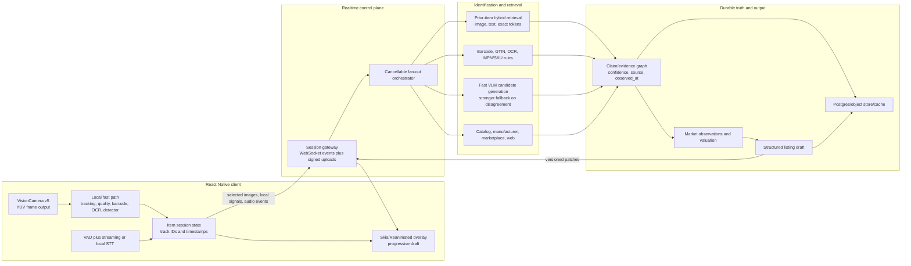
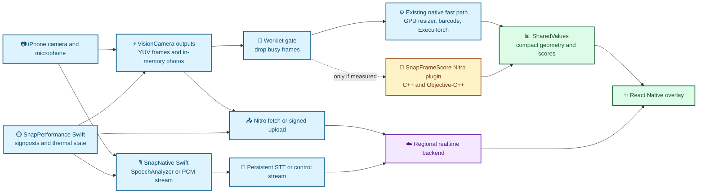

# Snap to Post: living product and technical brief

Status: implementation-ready draft 0.9  
Updated: 2026-08-18  
Purpose: turn a continuous camera-and-voice session into a fast, evidence-backed used-item listing draft.

## Confirmed product decisions

- **Destination:** the prototype is self-contained. It does not need third-party publishing. If successful, it will later be adapted into the existing internal marketplace.
- **Inventory:** broad household and consumer goods, including furniture, housewares, electronics, exercise equipment, sporting goods, and small appliances. The system cannot depend on one narrow category taxonomy.
- **Identity target:** category, brand, and exact model/SKU when one exists, supported by an official manufacturer page or a reputable new-retail listing such as Amazon or Walmart.
- **Pricing priority:** current new retail is the first and most important anchor. Secondhand asks or sold comparables are optional enrichment and must remain a visibly separate lane.
- **Live controls:** the normal flow has session start/stop plus a persistent on-screen Next Item button. The first prototype has no spoken command grammar. A manual capture control may exist as a fallback or experiment tool, but taking a still is not a required user action.
- **Automatic capture:** the system selects stills when the active item is stable, well exposed, in focus, sufficiently framed, and meaningfully different from already-retained views.
- **Progressive interface:** the camera remains visible while the active item outline, live dictation, identity candidates, evidence, and listing fields stream into a Skia/Reanimated overlay. Completed items continue processing in the background.
- **Identity degradation:** exact model/SKU is preferred, but low-confidence results stop at the highest supported level: product family, brand plus category, or category only. The system must not invent an OEM for generic housewares.
- **Voice as evidence:** spoken hints such as “IKEA plates” or “forks from Crate & Barrel” become search constraints and candidate signals, while remaining distinguishable from externally verified facts.
- **Prototype hardware:** optimize and benchmark first on the latest available iPhone Pro owned by the developer. Broader device support is outside the proof-of-concept scope.
- **Historical first-party scale:** approximately 3,653 items, 7,300–9,100 images, 74 offers, 207 offer/withdraw/accept events, 2,085 moved items, and roughly 760 real-world pickup occasions after grouping multi-item pickups.
- **Price terminology:** the desired product output is the current new-retail price, not launch MSRP. The exact semantics of any existing historical price column remain unverified and need a later read-only schema audit before use as a learning label.
- **Pricing evidence:** current manufacturer and reputable new-retail pages matter more to the proof of concept than secondhand comparables. OfferUp, Depop, eBay, Poshmark, and similar sources are optional later enrichment whose access, licensing, freshness, and sold-versus-active semantics must be validated source by source.
- **Voice-first start:** Start immediately begins microphone streaming and creates a provisional item intent from speech. Visual tracking and clean-shot capture attach when ready; search does not wait for a stable object if useful spoken terms already exist.
- **Stop behavior:** Stop ends new camera and microphone intake but allows accepted background work to complete.
- **Capture feedback:** automatic captures use a subtle haptic and animation. Manual capture appears when another view is requested, and explicit debug capture controls remain available during development.
- **Next-item safety:** the Next Item button always advances, even with weak or insufficient imagery. The item is flagged for later review; warning modals are deferred from the first prototype.
- **Review:** scanning never auto-posts. The user can open inventory review on demand, and Stop transitions into the review queue when available background content is ready. Each item receives a simple yes/no/edit decision. Slower enrichment may continue while review is open.
- **Post-ready evidence:** the definitive original manufacturer/product page and current-new price are desired when discoverable. Missing manufacturer/current-retail evidence reduces confidence and produces a visible missing-evidence state; it never blocks a generic item from entering review.
- **Speech scope and corrections:** voice is only for describing the active item. Item advance uses the Next Item button, while identity, transcript, image, condition, and pricing corrections use simple review buttons and fields.
- **Speech:** the product needs live speech-to-text with visible partial and finalized dictation; it does not need text-to-speech. Cloud audio processing is permitted for the proof of concept.
- **STT language:** English-only is sufficient for the proof of concept.
- **Market and network:** the first market is US/USD and a strong-network proof of concept is acceptable.
- **Optimization policy:** speed is the primary constraint for the proof of concept. Provider and infrastructure cost optimization is intentionally deferred.
- **Data permission:** the existing 3,653 items, images, and descriptions may be used for retrieval and evaluation. Raw audio from new sessions is ephemeral in the first prototype; selected images, finalized transcript, review edits, evidence, and timing telemetry may be retained as product records/evaluation events.
- **External-data policy:** public visibility is not by itself permission to automate collection, retain photos/text, or train a commercial model. External data must enter through an official API, an explicit license/authorization, a vendor contract that grants the required downstream rights, or a source-by-source legal review. Firecrawl, Browserbase, Apify, and similar tools provide collection infrastructure; they do not grant rights to the underlying content.
- **Future batch mode:** a v1.1/v2 “stitch” mode may detect and track many items from a wide image or sweep, then run identification jobs in parallel.
- **Batch sequencing:** multi-item stitch/sweep follows the single-item prototype. It should segment the source image/sweep into item crops, create one ordinary item job per crop, and fan those jobs through the same identification, evidence, pricing, and review pipeline in parallel.
- **Review rejection:** the exact behavior of the review “No” action is intentionally deferred; it is not required to prove capture, enrichment, or review.

These answers remove third-party listing schemas from the prototype and make the existing marketplace's retrieval and transaction history a central strategic advantage.

## Directional hard north star

The dream is to catalog roughly 400 storage-unit items in 5–10 minutes, but this is not a literal proof-of-concept acceptance test. Speaking useful context, repositioning objects, and revealing condition details create a physical ceiling. Use the number to enforce one product rule: **the app must not be the reason the user stops moving.**

Treat these as separate service objectives:

- **Intake throughput:** the camera/voice client can open and close item intents at human movement speed without waiting for identification or pricing.
- **First feedback latency:** speech, object lock, capture acknowledgement, and a provisional category/candidate appear immediately.
- **Completion latency:** official-page retrieval, current-new pricing, evidence reconciliation, and drafting finish asynchronously.
- **Backlog drain:** a long session can safely produce hundreds of independent jobs without provider stampedes, lost work, or an unusable review queue.

When speech arrives before a stable object, create a provisional `item_intent_id`, stream its text-derived query immediately, and attach `track_id` plus selected images later. Pressing the Next Item button closes the current intent even when enrichment is incomplete. Current and most-recent items receive interactive priority; older closed items run under bounded background concurrency.

The one-item flow remains the first experiment. A future multi-object stitch/sweep mode can test how much closer batch capture gets to the aspirational ceiling without creating a second enrichment architecture.

### Future stitch/sweep adapter

Treat batch capture as an input adapter, not a separate product pipeline:

1. Accept a wide photo, panorama, or short sweep.
2. Detect and segment distinct item regions.
3. Produce a crop, mask/bounding box, quality score, and provisional category for each region.
4. Deduplicate overlapping detections across adjacent frames or stitched regions.
5. Create one `item_intent_id` per retained region.
6. Submit all retained items to the existing single-item pipeline with bounded parallelism.
7. Present the resulting cards in the same inventory review queue.

The hard parts reserved for this later permutation are instance separation, duplicates, occlusion, tiny-object resolution, and associating group-level speech with the correct crops. The identity and enrichment system should not need to know whether an item originated from live single-item capture or batch segmentation.

## Working recommendation

Build this as a hybrid system with four independent lanes:

1. **On-device perception:** decide whether an object is present, track it, judge frame quality, read barcodes/text, and select the smallest set of useful images.
2. **Backend identification:** resolve the exact brand/model/variant by racing identifiers, prior-item retrieval, fast VLMs, catalog data, and web/marketplace sources.
3. **Evidence and market enrichment:** reconcile official specifications, current new prices, active used asks, sold comps where licensed data is available, and past first-party item history.
4. **Listing composition:** combine verified identity/specifications with the user's spoken condition observations, then stream a reviewable internal-marketplace draft back field by field.

Do not make one model responsible for the entire path. The magical experience comes from a fast cascade, partial results, caching, and asking the user only when the remaining ambiguity matters.

The core distinction is:

- **Detection/classification:** “There is a cordless drill in this region.” This can be fast and local.
- **Exact entity resolution:** “This is the DeWalt DCD791B, tool-only variant.” This needs identifiers, retrieval, external evidence, or a capable VLM.
- **Condition:** “The chuck is scratched and the battery is missing.” This must preserve what the user said and what the images visibly support.
- **Valuation:** “List at $89; likely transaction range $70–$82.” This is a separate market-data and policy problem, not an image-classification output.

## North-star experience

The ideal workflow is zero-tap by default:

1. The app opens directly into a warm camera session.
2. An unobtrusive overlay shows the object currently being tracked.
3. The app automatically collects a small set of high-value views when the object is stable, novel, and in focus.
4. The user speaks naturally: “Used twice. Small ding here. Charger is included, but no case.”
5. The app gives immediate haptic/visual acknowledgement. The user taps the persistent Next Item control when they move on.
6. The previous item closes for capture, but identification, retrieval, documentation, pricing, and draft generation continue in the background.
7. A draft card becomes useful incrementally and transitions to “post-ready review” when required evidence and fields cross their thresholds.
8. Low-confidence or missing-evidence items receive a visible review flag rather than interrupting the capture session.
9. Stop—or an explicit Review action—opens the accumulated inventory for yes/no/edit decisions. Nothing publishes automatically.

All speech is treated as description or evidence for the active item. The first prototype does not classify voice commands; item boundaries and corrections use explicit buttons and fields.

## Live session control contract

The proof of concept should use an explicit item boundary instead of guessing that the user has moved on:

- **Start:** opens one continuous camera-and-microphone session, warms the realtime backend connection, and immediately creates a provisional item intent. Speech can begin search before an eligible visual object stabilizes.
- **Next Item button:** immediately closes the current item's observation window and opens a new one, regardless of image quality. The closed item keeps processing off-screen and carries a review flag if evidence is weak.
- **Stop:** ends new capture and dictation for the whole session, but does not cancel already-accepted background work.
- **Manual capture:** a fallback shown when another view is needed, plus always-available development/debug controls. It forces one candidate still but does not replace automatic selection.

The camera surface is both viewfinder and progress display. Keep high-frequency geometry, focus/quality indicators, and capture acknowledgement in worklet/shared-value/native rendering paths. Send only low-frequency semantic transitions—candidate changed, field verified, item ready—to React state. Use Skia/Reanimated for the animated visual layer, but keep Start, the Next Item button, and Stop as accessible native React Native/Expo controls above the preview rather than baking essential hit targets into the canvas.

An item's visible state machine is:

```text
observing -> collecting views -> identifying -> enriching -> post-ready review
                  |                    |
                  +---- needs view ----+---- needs clarification
```

These stages may overlap. “Post-ready review” means the item has enough captured context to review; it does not require manufacturer/retail evidence, does not mean every external search has finished, and never means the listing has been published.

### Inventory review contract

Capture mode optimizes for motion; review mode optimizes for correctness:

- Review can be opened at any time and is the default destination after Stop.
- Each item shows selected photos, finalized dictation, proposed identity, current-new evidence, confidence, and unresolved fields.
- **Yes** accepts the reviewed item into the inventory batch; it does not publish externally.
- **Edit** exposes simple controls for identity, transcript/condition, photos, and price.
- **No** removes the item from the accepted batch while preserving whatever recovery/undo policy the prototype chooses.
- Background jobs may patch the review card while it is untouched. Once the user edits or approves a field, background enrichment cannot silently overwrite that decision.

The review screen is where slower manufacturer-page validation, richer specifications, and optional secondhand research can finish without delaying capture.

The camera should not continuously upload 30–60 FPS video. It should continuously *understand locally* and transmit selected keyframes, crops, identifiers, embeddings, and timestamped audio. This is faster, cheaper, and more private.

## System architecture



## Client pipeline

### Camera and frame processing

Use VisionCamera v5 as the capture backbone. Keep the camera mounted and toggle `isActive` rather than rebuilding the session. Use a low-resolution YUV frame output for perception, an in-memory photo output for selected stills, and explicit backpressure so the camera never stalls.

Initial frame pipeline:

1. Sample at roughly 5–10 inference frames per second while preserving a 30/60 FPS preview.
2. Run cheap frame-quality signals first: blur, exposure, motion, occlusion, framing, and novelty.
3. Run barcode scanning and a small object detector on eligible frames.
4. Track detections across frames and assign a stable `track_id`.
5. Trigger an in-memory still when stability, coverage, and novelty thresholds are met.
6. Keep the best 3–5 views, not every image.
7. Generate a compact image embedding for local deduplication and backend retrieval.

Auto-capture should be a scored gate rather than a timer. A first pass can combine blur, exposure, motion, object coverage, occlusion, pose novelty, and cooldown into one eligibility score. Crossing the threshold requests an in-memory photo; the preview-image callback supplies immediate visual acknowledgement while the full photo remains available for upload or local inference. Captures must be rate-limited per track and rejected when they add no new coverage.

The first prototype should keep the normal VisionCamera preview and draw Skia/Reanimated overlays above it. A full `SkiaCamera` preview is an experiment, not a prerequisite: it always adds its own frame output and can increase the GPU/thermal budget. Measure it only if the desired overlay cannot remain smooth with the simpler composition.

VisionCamera v5 requires `react-native-vision-camera-worklets` for frame processing. Every received frame must be disposed, and busy processors should drop work rather than create an unbounded queue. The current package list has `react-native-worklets` but not the VisionCamera-specific worklets package.

### What belongs on device

Good local candidates:

- object presence and bounding boxes
- frame quality and best-shot selection
- barcode/QR detection
- OCR or text-region detection when the model/device budget allows it
- visual embeddings for novelty, deduplication, and candidate retrieval
- privacy redaction before upload
- VAD and optionally speech-to-text
- session tracking and offline capture queue

Do not require exact brand/model/SKU resolution on device for the first version. A local result can seed backend search, but should not anchor the system when stronger evidence disagrees.

### Voice and item binding

Every utterance should carry `session_id`, `item_intent_id`, optional `track_id`, start/end timestamps, transcript, and whether it was interpreted as an identity hint or condition observation. Before a visual track exists, speech binds to the provisional item intent. After attachment, both voice and visual evidence resolve to the same item. The first prototype has no spoken command or correction grammar; item advance and corrections are explicit UI events.

Render partial dictation immediately and visually mark final text when the recognizer commits it. Brand/store hints from speech should raise or lower identity candidates; they must not silently become verified manufacturer claims.

This live text feature is streaming speech recognition/transcription (STT). Text-to-speech is explicitly out of scope.

Benchmark these STT lanes with the same storage-unit audio and device:

- **Apple SpeechAnalyzer/SpeechTranscriber:** native Swift, entirely on-device, and capable of progressive/volatile live results. This is the on-device baseline and offline-fallback candidate.
- **ElevenLabs Scribe v2 Realtime:** WebSocket partial and committed transcripts; the provider advertises roughly 150 ms latency.
- **Deepgram Nova-3:** streaming WebSocket transcription; the provider documents sub-300 ms model latency and 20–100 ms audio buffers.
- **OpenAI GPT-Realtime-Whisper:** streaming low-latency transcript deltas through realtime transcription sessions.
- **AssemblyAI Universal Streaming:** another low-latency WebSocket candidate if the leading options disagree on accuracy or stability.
- **Groq Whisper:** very fast utterance/file transcription, but the documented endpoint is chunk/file oriented rather than the cleanest continuous-partial UI path.
- **React Native ExecuTorch:** Moonshine/Whisper remains an experiment, but published iPhone 17 Pro first-token latency and memory figures make it less compelling than native SpeechAnalyzer for the initial live-dictation lane.

Measure emission latency, partial revision rate, finalization latency, brand/model/store-name accuracy, reconnect behavior, CPU, memory, battery, and 10/30-minute thermal impact. Choose the first provider from this physical-device benchmark, not marketing latency alone. A dual lane—fast local partials plus cloud canonical finals—is allowed only if it improves real results without damaging camera throughput or thermals.

The listing generator should distinguish:

- `user_observed`: explicit statements such as “battery missing”
- `visually_observed`: supported by a specific image region
- `inferred`: plausible but unverified
- `official_fact`: supported by a catalog or manufacturer source

Never silently rewrite a user-observed defect into a more favorable condition claim.

## Backend streaming design

**PoC deployment decision (updated 2026-08-20):** the backend is a single Hono process on Node — pnpm-managed like the rest of the repo, run with `tsx watch`, with WebSockets provided by `@hono/node-server` v2 and `ws` — running locally on the Mac with the phone connecting over LAN IP. Zero deploys and no cold starts maximize iteration speed; Fly.io (US East) is the later off-LAN path. Vercel is not used for the control plane because serverless cannot hold the persistent WebSocket. Datastore is a dev copy of the Supabase database (pg_dump restore) with pgvector enabled and Supabase Storage as the object store; the prototype never writes to the live marketplace project.

Use a **WebSocket control plane** for bidirectional session events and incremental server results. Use signed HTTP uploads or a direct object-store upload for full-resolution images. If continuous cloud audio is selected, use a dedicated audio stream rather than embedding base64 audio in JSON.

### Fast upload contract

Upload only selected evidence, in two stages:

1. Send a small encoded crop/preview immediately with `session_id`, `item_intent_id`, `track_id`, capture timestamp, orientation, quality score, OCR/barcode signals, and the current transcript revision. This is sufficient to start remote vision and search.
2. Upload the selected full-quality still directly to object storage with a signed request in the background. Do not proxy image bytes through JSON, React state, or the control WebSocket.

Use content hashes and idempotency keys so retries do not create duplicate images. Persist a local item manifest before the Next Item button transition completes; pending uploads may retry without blocking the next item. Keep one warm control connection for the session and one dedicated STT stream rather than opening per-item sockets.

Suggested client-to-server events:

- `session.started`
- `item.intent_started`
- `item.track_started`
- `item.track_attached`
- `frame.signal`
- `image.selected`
- `image.uploaded`
- `barcode.detected`
- `ocr.detected`
- `embedding.ready`
- `audio.partial`
- `audio.final`
- `review.correction`
- `item.closed`
- `task.cancelled`

Suggested server-to-client events:

- `identity.candidate`
- `identity.confirmed`
- `evidence.patch`
- `metadata.patch`
- `market.patch`
- `condition.patch`
- `draft.patch`
- `review.flag`
- `item.ready`
- `task.failed`

Every event needs:

- `event_id` for idempotency
- `session_id`, `item_intent_id`, and optional `track_id`
- monotonically increasing `revision`
- server/client timestamps
- schema version
- confidence where applicable
- provenance references for factual claims

Stream **structured patches**, not raw model prose. For example, stream a title candidate, brand, model, price bands, and evidence independently. Raw token streaming can look fast while leaving the product state unusable.

The server should maintain durable item-job state so the app can background, disconnect, and resume. The first prototype may use an in-process fan-out with deadlines and cancellation; production needs a durable queue/workflow and transactional state transitions.

## Retrieval and vector memory

Existing user posts can make the system materially faster. Use them first as a retrieval corpus and labeled evaluation source; do not jump directly to post-training. At roughly 3,653 items, a dedicated vector database is not required for scale. An existing Postgres vector/full-text index—or even a benchmarkable local index for the proof of concept—is enough unless measured latency or operational needs prove otherwise.

### Recommended record design

Keep durable item truth in the primary database and object storage. Store references and searchable features in the vector system.

For each historical item, derive:

- one embedding per usable image
- one pooled item-level image embedding
- a normalized text embedding from title, brand, model, attributes, and description
- exact lexical fields: GTIN, UPC/EAN, MPN, SKU, ASIN, model number, and brand
- category, geography, condition, timestamps, listing destination, and data permissions
- manufacturer/new-reference price where present, interest/bids, offers, counteroffers, acceptance/withdrawal events, and later fulfillment outcome as separate facts; do not assume the existing price field is transaction truth
- ground-truth/correction status and confidence
- embedding model name, version, dimensions, and preprocessing version

Use three retrieval signals:

1. **Dense image similarity** to find visually similar past items.
2. **Dense text similarity** for semantic descriptions and spoken notes.
3. **Sparse/BM25 exact-token search** for model numbers, SKUs, and rare identifiers.

Fuse the signals, apply metadata filters, then rerank the top candidates with exact identifier matches and a VLM/cross-encoder. Pinecone's current guidance explicitly recommends hybrid retrieval because semantic search can miss exact tokens and lexical search can miss synonyms. Product identity is exactly that mixed workload.

### Pinecone versus an existing database

Keep a provider-neutral `ItemRetriever` boundary. Start with the smallest system that can produce a representative benchmark:

- If the corpus is modest and an existing Postgres stack is already operational, a vector extension plus full-text indexes may be enough for the prototype.
- Pinecone is attractive when managed ANN performance, filtering, namespaces, high query volume, or operational simplicity justify a dedicated service.

Do not choose Pinecone from a conceptual architecture diagram alone. Benchmark recall@K, p50/p95 latency, freshness after writes, metadata-filter latency, cost, and tenant-isolation behavior against the real item corpus.

### Tenant and privacy boundaries

Use separate logical spaces for:

- private per-user memory
- consented global retrieval corpus
- internal evaluation/training data
- public/catalog data

A global item index must not expose another user's private description, location, image, or voice note. Returned candidates should reference authorized durable records; vector metadata is not an authorization layer.

### Retrieval fast path

For a new capture:

1. Query the local/session cache by perceptual hash and embedding.
2. Query the global historical corpus with image + text + exact-token signals.
3. Immediately stream the best historical candidate if it clears a calibrated threshold.
4. In parallel, refresh identity and price from external sources.
5. Replace or confirm the candidate as evidence arrives.

This creates an “instant memory” effect without pretending old prices are current.

## External identification and enrichment

Use an evidence fan-out with strict deadlines. The result is a claim graph, not a blob of merged text.

### High-value sources

| Signal | Role | Important limitation |
|---|---|---|
| Barcode/GTIN + GS1 | Exact identifier and brand-owner validation | Commercial access; registry verification does not guarantee every attribute is current or complete |
| Exa `instant`/`fast` search | Low-latency manufacturer/retailer URL candidates from early voice or visual tokens | Search results are candidates, not verified claims; synthesis adds latency |
| Perplexity Search/Sonar | Raw ranked results or a parallel grounded answer with citations | Generated synthesis should not outrank direct product evidence |
| Groq vision inference | Very fast image/text candidate generation and OCR/structured extraction | An inference provider, not a market-data source |
| eBay Browse API | Current listings; keyword, GTIN, and image search | Primarily active marketplace observations; image search is marketplace-limited |
| eBay Marketplace Insights | Sold-history signal | Restricted/limited release and not open to new users at present |
| Keepa | Amazon product data, offers, and price history | Amazon-specific; freshness and offer timestamps must be checked |
| Exa | Find manufacturer pages, manuals, and other web evidence | Web discovery, not authoritative product identity by itself |
| Browserbase/Stagehand | Dynamic-site extraction fallback | Slower and more brittle than APIs; requires site-by-site legal/terms review |
| Manufacturer APIs/pages | Official specifications/manuals | Coverage and structure vary widely |
| Existing first-party posts and offer history | Fast identity candidates and evaluation examples | Only 74 known offers and ambiguous price semantics; insufficient as the primary proof-of-concept valuation source |

Do not market “sold comps everywhere” until the data rights and provider coverage are known. eBay's public Browse API supports current search and image search, while sales-history access is restricted. Browser automation is not a universal substitute for licensed marketplace data.

### Latency-first evidence race

The hot path should not wait on an eBay request or a browser session:

1. **Immediate:** partial STT tokens create a provisional query before visual lock.
2. **Local/cache:** query exact tokens, perceptual hashes, embeddings, and the canonical public-product cache.
3. **Fast web discovery:** send a minimal query to Exa `instant`/`fast` and optionally Perplexity Search. Request only a few raw results; do not request Exa structured synthesis on the first hop because it adds about two seconds.
4. **Fast visual candidate:** send the first useful crop plus voice hints to a low-latency VLM lane such as Groq-hosted multimodal inference.
5. **Reconcile:** rank candidate manufacturer/retailer URLs against OCR, barcode, image similarity, spoken hints, and source quality.
6. **Background evidence:** Firecrawl fetches/scrapes direct pages, while Browserbase/Stagehand is reserved for dynamic pages that genuinely require a browser.
7. **Persist:** verified public facts, URLs, embeddings, and freshness timestamps update the canonical product cache for later sessions.

Firecrawl's cached scrape controls are well suited to background refresh and cache hits. Browserbase's own architecture recommends search/fetch before launching a browser; follow that boundary. Neither tool should sit between automatic capture and the first visible identity candidate.

### Canonical public-product cache

Cache reusable public knowledge globally by stable identity such as GTIN, MPN/model, ASIN, canonical manufacturer URL, or a carefully reconciled entity ID:

- brand, product family, model, variant, identifiers, and official images
- manufacturer/original product URL and reputable retailer URLs
- current-new observations with currency, seller, availability, and `observed_at`
- normalized specifications and manuals with claim-level provenance
- image/text embeddings and exact searchable tokens
- source-specific TTL, last verification, and conflict state

Start with Postgres plus pgvector/full-text search. Keep a provider-neutral retrieval boundary so Pinecone can be benchmarked if the public entity graph or query concurrency grows enough to justify it. Public facts can improve the next user's latency; private descriptions, voice, condition, and locations cannot silently become global cache content.

### Price vocabulary

The UI and data model must keep these separate:

- `msrp_at_launch`
- `current_new_retail`
- `active_used_ask_distribution`
- `verified_sold_comp_distribution`
- `first_party_historical_ask_distribution`
- `first_party_offer_distribution`
- `first_party_counteroffer_distribution`
- `first_party_agreed_price_distribution`
- `first_party_historical_sale_distribution`
- `recommended_list_price`
- `expected_transaction_range`
- `quick_sale_price`

Every observation needs currency, condition, geography, source, URL/identifier, sample size, and `observed_at`. A recommendation should show which price lanes were available and which were missing.

### First-party pricing labels

Do not flatten the internal commerce lifecycle into one `sale_price` and one `time_to_sale`. The following event model remains useful for future learning, but pricing-model work is deferred until the schema and label semantics are audited. Preserve at least:

1. listing published at the original ask
2. first interest/bid
3. first monetary offer
4. each counteroffer
5. final price agreement or accepted bid
6. pickup proposed
7. pickup scheduled
8. pickup completed
9. cancellation/no-show/backout when applicable

This creates three distinct learning problems:

- **Demand:** probability and time to receive interest or an offer.
- **Price agreement:** the price distribution and time required to reach an accepted offer.
- **Fulfillment:** probability and time for the agreed exchange to be completed.

Pickup delay is partly scheduling friction, so it should not teach the pricing model that an item was undesirable. For an initial quick-sale estimator, define “quick” against time to a qualified offer or price agreement—for example, agreement within 24, 48, or 72 hours—not time to physical pickup.

If the first-party dataset later supports a pricing model, it should be a calibrated distribution or quantile model, not one magic number:

- quick-sale price for a chosen agreement horizon
- expected accepted-price range
- probability of agreement at several candidate prices
- confidence/coverage based on the number and similarity of historical examples

The external `current_new_retail` value remains a separate factual anchor and feature. It must not be inferred solely from historical peer-to-peer behavior.

## Identity and evidence contract

Illustrative server-owned object:

```ts
type EvidenceClaim<T> = {
  value: T;
  status: 'observed' | 'inferred' | 'verified' | 'conflicted';
  confidence: number;
  sourceIds: string[];
  observedAt?: string;
};

type ItemResolution = {
  sessionId: string;
  trackId: string;
  revision: number;
  category: EvidenceClaim<string>;
  identity: {
    brand?: EvidenceClaim<string>;
    productName?: EvidenceClaim<string>;
    model?: EvidenceClaim<string>;
    variant?: EvidenceClaim<string>;
    gtin?: EvidenceClaim<string>;
    mpn?: EvidenceClaim<string>;
    asin?: EvidenceClaim<string>;
  };
  condition: {
    userObservations: EvidenceClaim<string>[];
    visualObservations: EvidenceClaim<string>[];
    missingParts: EvidenceClaim<string>[];
    grade?: EvidenceClaim<string>;
  };
  market: {
    currentNew?: MarketDistribution;
    activeUsedAsks?: MarketDistribution;
    soldComps?: MarketDistribution;
    recommendedList?: MoneyRange;
    expectedTransaction?: MoneyRange;
  };
  draft: {
    title?: string;
    description?: string;
    attributes?: Record<string, string>;
    warnings: string[];
  };
};
```

The client can render partial versions while the server remains authoritative for revisions and provenance.

## Model cascade

### On-device models

Benchmark at least two detectors and one image-embedding model on target devices. React Native ExecuTorch's published 0.9 benchmarks show that small object detectors and CLIP image embeddings can have native forward-pass times in the tens of milliseconds on current flagship devices, but those figures exclude preprocessing, postprocessing, React Native overhead, first-run initialization, and thermal degradation.

Initial candidates:

- SSDLite 320 MobileNet V3 for a simple detector baseline
- one small YOLO-family model for accuracy/speed comparison, subject to license review
- CLIP-style image embedding for retrieval baseline
- barcode scanner before general OCR
- OCR only on selected stable regions, not every frame

### PyTorch and ExecuTorch decision

Use **PyTorch off-device** for model selection, evaluation, fine-tuning, quantization, and export. Use **ExecuTorch on-device** through `react-native-executorch`. Do not add legacy PyTorch Mobile, `react-native-pytorch-core`, or PyTorch Live: PyTorch Mobile is no longer actively supported, and ExecuTorch is PyTorch's current edge-deployment runtime.

The deployment shape is:

```text
PyTorch model or Hugging Face checkpoint
    → evaluate/fine-tune in Python
    → export and lower for the target backend
    → quantized/backend-specific .pte artifact
    → react-native-executorch on the physical iPhone
```

For the iPhone proof of concept, benchmark Core ML and XNNPACK artifacts where the chosen model publishes/supports both. Core ML may dispatch across CPU, GPU, and Apple Neural Engine; XNNPACK is the portable CPU baseline. Release-runtime measurements on the real phone decide the winner. The exported artifact is backend-specific, and unsupported partitions can fall back to portable CPU execution, so “Core ML selected” does not by itself prove full hardware acceleration.

ExecuTorch helps this product in four narrow jobs:

1. **Object detection:** decide whether a useful object exists and return a bounding box/category for framing and auto-capture.
2. **Image embeddings:** novelty/deduplication and first-party similarity retrieval, preferably on selected stable frames or retained stills rather than every preview frame.
3. **Optional lightweight classification:** a coarse category prior when detection labels are insufficient.
4. **Future segmentation:** split a multi-item image/sweep into item crops after the single-item pipeline works.

It is not the first solution for:

- exact brand/model/SKU resolution across arbitrary household goods;
- continuous OCR on every frame;
- the live partial-transcription experience;
- listing prose generation or official retail evidence retrieval.

Those jobs are better served by identifiers, selected-frame OCR, Apple/cloud speech, backend retrieval/VLMs, and source validation. In particular, the published React Native ExecuTorch OCR and segmentation footprints are large enough that they should not be loaded into the always-on camera path without a specific benchmark.

#### Required preprocessing experiment

The current React Native ExecuTorch 0.9.x VisionCamera integration has an important constraint: `runOnFrame` expects an RGB `CameraFrameOutput` and performs synchronous worklet inference. VisionCamera's lower-bandwidth general fast path is YUV. Do not assume both recommendations can be combined for free.

Benchmark these two pipelines on the physical iPhone:

- **A — library fast-start:** low-resolution RGB frame output → `react-native-executorch.runOnFrame` → `dropFramesWhileBusy`.
- **B — camera-native path:** YUV frame output → GPU resize/convert only on sampled eligible frames → model/native binding → compact result.

Pipeline A should be implemented first because it proves model utility quickly. Pipeline B is promoted only if A's RGB conversion, worklet blocking, frame drops, power, or thermals miss the budget. A Nitro `SnapFrameScore`/inference plugin is the likely implementation boundary for B because VisionCamera v5 native frame plugins are Nitro HybridObjects and can retain native buffer ownership without sending frames through React state.

Published model-forward numbers are useful for choosing experiments, not for claiming end-to-end performance. They explicitly exclude resize/normalization, postprocessing, React Native scheduling, camera conversion, model initialization, and thermal degradation. Measure all of those in the latency contract below.

### Frontier VLMs

Hide providers behind a typed adapter and benchmark with the real evaluation set. Use:

- one fast/cost-efficient multimodal frontier model as the default candidate generator
- a second provider as a disagreement/availability hedge
- one stronger, slower model only when identity confidence is low or claims conflict
- one hosted open-weight VLM for cost/control comparison

The linked “Gemini 3.7 Flash” page could not be verified. Google's current official model guide lists Gemini 3.6 Flash as the Flash model for spatial/multimodal reasoning. Treat model names as configuration, not architecture.

The server can use AI SDK for provider abstraction, structured outputs, and streaming, but the domain event protocol should remain independent of AI SDK so the mobile client never depends on a provider's wire format.

### TypeGPU and WebGPU

TypeGPU currently documents React Native support through `react-native-webgpu`. Keep it as an experiment lane for custom preprocessing, GPU similarity, shaders, or novel kernels. Do not put it on the critical path until a benchmark proves that buffer interop and dispatch outperform the existing camera resizer/platform ML delegate. Skia should render overlays; it is not the default inference engine.

### When native code is justified

Add C++/Swift/Kotlin/Rust only when a trace identifies a real boundary cost or missing capability:

- zero-copy camera buffer preprocessing
- a custom VisionCamera output or frame plugin
- platform-specific Core ML/Metal or Android accelerator integration
- optimized tracker or feature extractor
- native media transport/encoding

Nitro Modules are the preferred React Native bridge for typed C++/Swift/Kotlin modules. Rust may be appropriate for a portable algorithmic core, but it adds an FFI and toolchain boundary and is not inherently faster than a well-designed C++/platform implementation.

## Performance design

### Initial experience targets

These are aggressive experiment targets, not current guarantees:

| Milestone | p50 target | p95 target |
|---|---:|---:|
| Overlay reacts to an eligible object | 100 ms | 250 ms |
| Item locks and first useful still is selected | 350 ms | 800 ms |
| First live transcript delta | 100 ms | 300 ms |
| Voice-derived search begins | 150 ms | 350 ms |
| First provisional identity candidate is visible | 500 ms | 1.5 s |
| Core identity/specification fields are useful | 1.5 s | 4 s |
| Initial current-new pricing evidence is visible | 2.5 s | 7 s |
| Reviewable listing draft is visible | 5 s | 15 s |

The first physical-device benchmark is the latest iPhone Pro. Cost is not an optimization target yet. These numbers are aggressive experiment thresholds rather than guarantees; intake must remain responsive even when post-ready work exceeds them.

Also measure:

- top-1 and top-5 exact identity accuracy
- false auto-captures and duplicate items per session
- percentage of items requiring a user question
- battery drain and temperature after 5, 15, and 30 minutes
- memory pressure and dropped camera frames
- bytes uploaded per item
- cost per resolved item
- cache/retrieval hit rate
- time to recover after network loss

### Backend techniques

- prewarm authentication, configuration, and realtime connections
- use connection pools, keep-alive, and regional endpoints
- upload the first best crop immediately; add other views incrementally
- race independent providers with per-provider deadlines
- cancel losers after confidence crosses a calibrated threshold
- cascade from cheap/fast to strong/slow models
- cache stable facts by GTIN/MPN and volatile market data with short TTLs
- cache candidates by perceptual hash and embedding neighborhood
- use stale-while-revalidate for old market observations, clearly timestamped
- stream structured patches as soon as each claim becomes useful
- avoid oversized JSON and vector values in query responses
- keep raw images in object storage, not inside the vector database
- collect distributed spans from camera timestamp through client render

`react-native-nitro-fetch` is worth a benchmark for native HTTP, WebSocket prewarming, and Instruments/Perfetto visibility. It cannot prefetch the unknown next item's result, but it can warm session/configuration endpoints and the persistent control connection. Start with explicit imports rather than a global `fetch` replacement.

For this project, native WebSocket prewarming is especially relevant because it can begin the TLS/upgrade path before React Native boots on later launches. Use one persistent control stream and a dedicated STT audio connection; do not create a new socket per item. Use Instruments signposts and server spans to separate DNS/TLS, upload, provider, parsing, and render latency before introducing custom C++/Rust transport code.

## Native implementation boundary

The proof of concept does **not** need a native rewrite of React Native. Most of the hot path is already native: VisionCamera owns the capture session and buffers, the VisionCamera GPU resizer can own YUV conversion/resizing, ExecuTorch can use platform delegates, Reanimated/Skia own high-frequency drawing, and Nitro networking can bypass `XMLHttpRequest`. The first build should prove those paths before adding custom FFI.

The likely v0 custom-native surface is:

1. one local iOS Expo module for live speech/audio and performance telemetry;
2. one conditional Nitro frame plugin for quality scoring and tracking, only if the traced baseline misses the capture budget;
3. no Rust and no custom transport stack in the first proof of concept.

Expo Modules and Nitro Modules are complementary rather than competing choices:

- **Expo Swift module:** platform-service orchestration—`AVAudioEngine`, `SpeechAnalyzer`, app/audio-session lifecycle, permissions, interruptions, signposts, and low-rate transcript/thermal events.
- **Nitro module:** high-frequency or buffer-owning work—VisionCamera `Frame` access, C++ scoring/tracking/inference, shared native objects, and typed `ArrayBuffer`/struct results with minimal JSI conversion overhead.

A feature being native does not automatically require Nitro. If JavaScript receives a few transcript deltas or telemetry events per second, an Expo module is simpler and the bridge is not the bottleneck. If raw camera frames, per-frame histograms, tensors, or frequent PCM chunks cross the boundary, use Nitro or keep the entire operation native and emit only semantic results.



### Native code to write now

#### `SnapNative` local Expo module: Swift

Scaffold this as a local Expo module rather than editing generated `ios/` files directly. Keep its JavaScript surface small and event-oriented.

Responsibilities:

- own an `AVAudioEngine` microphone tap and emit 16 kHz mono PCM chunks for the cloud-STT experiment without base64 conversion;
- run Apple `SpeechAnalyzer`/`SpeechTranscriber` for the on-device comparison when the target iOS version supports it;
- emit compact partial/final transcript events carrying `item_intent_id`, utterance ID, revision, confidence when available, and monotonic audio offsets;
- stop and release the microphone deterministically on Stop, backgrounding, interruption, or module destruction;
- discard raw audio after the live transcription obligation is complete;
- expose capability checks so the application can choose Apple-local or cloud streaming without branching the UI;
- generate `OSSignposter` events and intervals for camera, audio, capture, encode, upload, candidate receipt, and UI acknowledgement;
- expose `ProcessInfo.thermalState`, memory-pressure notifications, and the current performance-session identifier to the debug HUD.

For cloud speech, first test 40–100 ms binary PCM chunks because the audio bitrate is small. If moving those chunks through the Expo event surface shows measurable scheduling/copy overhead, either keep the cloud WebSocket inside the Swift module or add a small Nitro `SnapAudioStream` HybridObject that exposes native buffers. Do not commit to a provider-specific native socket before that trace exists.

Proposed TypeScript-facing contract:

```ts
type SpeechMode = 'apple-local' | 'pcm-stream'

type TranscriptDelta = {
  itemIntentId: string
  utteranceId: string
  revision: number
  text: string
  isFinal: boolean
  audioStartMs: number
  audioEndMs: number
}

SnapNative.getCapabilities(): NativeCapabilities
SnapNative.startSpeech(options: { mode: SpeechMode; locale: 'en-US' }): Promise<void>
SnapNative.stopSpeech(): Promise<void>
SnapNative.mark(event: PerformanceEvent): void
SnapNative.beginSpan(name: PerformanceSpan, attributes: TraceAttributes): string
SnapNative.endSpan(spanId: string, attributes?: TraceAttributes): void
SnapNative.getThermalState(): ThermalState
```

Transcript and low-rate telemetry events may cross the Expo module boundary. Camera frames, full-resolution pixel buffers, and per-frame histograms must not.

### Native code to write only after measurement

#### `SnapFrameScore`: Nitro C++/Objective-C++ frame plugin

Build this only if the worklet plus existing native plugins cannot keep analysis under budget or if required luma-plane access is missing. It accepts a VisionCamera `Frame`/native `CVPixelBuffer`, works on the Y plane without copying a full RGB image, and returns one compact structure.

Candidate calculations:

- blur/sharpness from gradient energy or variance of Laplacian;
- exposure histogram and highlight/shadow clipping;
- inter-frame motion and stability on a small luma pyramid;
- object coverage and edge truncation from detector boxes;
- pose/view novelty against the retained captures;
- perceptual hash for near-duplicate rejection;
- a small IoU/Kalman tracker if detector output needs more stable `track_id` assignment.

The plugin should have a fixed-size output, no heap allocation on the steady-state frame path, no synchronous JavaScript callback, explicit buffer lifetime rules, and signposts around each stage. Run it through VisionCamera's async runner, allow at most one pending analysis task, and drop work immediately when busy.

Do not write a custom GPU converter. Use the VisionCamera Metal resizer for YUV-to-tensor conversion first. Add a Metal compute kernel only if Instruments shows the quality-score CPU pass itself is material—roughly a repeatable multi-millisecond share of the analysis budget—not merely because Metal is available.

#### `SnapUpload`: Swift direct-photo uploader

This is conditional. Start with in-memory VisionCamera photos, a small first crop, signed object-storage uploads, and explicit Nitro networking calls. Add a native uploader only if traces show a material JS/file/copy boundary.

If needed, it should:

- accept an encoded image/native photo reference rather than a base64 string;
- upload the first small crop immediately and the full selected image later;
- use `URLSessionUploadTask`, report only progress and the durable object receipt, and collect `URLSessionTaskMetrics`;
- bound concurrency and cancel superseded views by `image_id`;
- never proxy large image bytes through React state.

#### `SnapLocalIndex`: C++ approximate-nearest-neighbor adapter

This is a later optimization, not part of the first slice. The existing 7,300–9,100 historical images are small enough to benchmark as a compact on-device embedding index, especially if embeddings are quantized, but server-side Postgres/pgvector is simpler and easier to update.

Promote an on-device C++ ANN index only if it improves first-candidate latency or offline behavior enough to justify index synchronization, versioning, privacy boundaries, and additional app size. The module would accept one embedding and return only item IDs/distances; metadata remains in the normal store.

### Native code not planned for v0

- **Rust:** no initial Rust crate. Apple audio/speech/thermal APIs are native Swift, and VisionCamera/Nitro interop is already centered on C++/Objective-C++/Swift. Rust adds another FFI and build-toolchain boundary without removing the measured network/provider costs. Reconsider it only for a genuinely shared iOS/Android/server algorithmic core.
- **Custom camera session:** do not bypass VisionCamera with a second `AVCaptureSession` implementation.
- **Custom WebSocket/TLS stack:** do not compete with URLSession or NitroWebSocket before measuring them.
- **Custom image renderer:** keep the normal native camera preview and overlay Skia/Reanimated above it. `SkiaCamera` is an experiment because it necessarily adds a frame output.
- **Native backend rewrite:** use an always-on regional TypeScript gateway initially. Search and model latency will dominate. Move a saturated gateway/worker to Go or Rust only if production traces show event-loop or garbage-collection delay after provider time is removed.

### VisionCamera session contract

Configure the session once and keep it warm:

- one physical wide-angle rear camera for the proof of concept;
- one low-resolution perception output: RGB for the initial `react-native-executorch.runOnFrame` baseline, then YUV for the optimized native/resizer experiment;
- one in-memory `CameraPhotoOutput` created once, with a preview-image callback;
- all required outputs attached before starting; no per-item output or constraint reconfiguration;
- preview at 30 or 60 FPS as the device/thermal experiment permits, while analysis is sampled at 5–10 FPS;
- `qualityPrioritization: 'speed'`, with HDR and cinematic stabilization off for the intake path;
- GPU resize to the exact detector/embedding input dimensions on the YUV experiment path;
- `try/finally` disposal for every frame and resized GPU buffer;
- one async analysis runner with strict rejection/backpressure;
- direct SharedValue updates for high-frequency geometry and quality indicators;
- React state only for low-frequency semantic transitions.

## Latency measurement contract

Optimization begins with a single trace vocabulary. Every client item uses `session_id`, `item_intent_id`, `track_id`, `image_id`, `revision`, and W3C `traceparent` where a network boundary is crossed. The client and server use their own monotonic clocks for durations; raw monotonic timestamps from different machines are never subtracted from each other.

### Required spans and events

| Lane | Marker | What it isolates |
|---|---|---|
| Session | Start pressed → first camera frame | camera/session cold start |
| Speech | microphone tap installed → first PCM chunk | audio startup |
| Speech | first PCM chunk → first visible partial | network plus STT first-token latency |
| Vision | frame received → quality score ready | preprocessing and gate cost |
| Vision | eligible frame → capture request | gating/scheduling delay |
| Capture | capture request → preview image | perceived shutter latency |
| Capture | capture request → full photo ready | ISP and encode latency |
| Upload | selected crop ready → server receipt | encode/copy/network/object-ingest cost |
| Search | first useful voice or image signal → provider dispatch | client/backend orchestration delay |
| Identity | first usable signal → first candidate patch rendered | end-to-end magical-feedback latency |
| Evidence | item closed → official/new-retail evidence rendered | slower enrichment latency |
| Queue | Next Item button tap → new intent ready | whether the app blocks human movement |
| Backlog | item closed → reviewable | total drain latency and starvation |

On iOS, use `OSSignposter` and Instruments Points of Interest for native intervals. Use VisionCamera dropped-frame/async-runner counters, Nitro's Network Inspector for request triage, Nitro Instruments tracing for native HTTP/WebSocket intervals, and `URLSessionTaskMetrics` when a direct URLSession path is used. On the backend, use OpenTelemetry spans for gateway receipt, cache lookup, vector search, provider queue/TTFT/completion, evidence validation, object-store writes, and patch emission.

The development HUD should display:

- preview FPS and UI frame time;
- analysis requested/accepted/rejected FPS;
- p50/p95 frame-gate duration and last capture age;
- selected/duplicate/weak-photo counts;
- microphone-to-partial latency;
- WebSocket round-trip time and reconnect count;
- current upload throughput, pending bytes, and item backlog depth;
- first-candidate, first-price, and post-ready elapsed time;
- memory footprint and thermal state;
- provider-by-provider TTFT, completion time, timeout, cancellation, and cache-hit status.

Export one compact JSON trace per hands-on session so runs can be compared without building a formal end-to-end suite. Report p50, p95, and p99 plus failure counts; averages will hide the stalls that make a realtime product feel broken.

### Performance acceptance budgets

Retain the earlier experience targets and add these invariants:

- Next Item button acknowledgement p95 under 50 ms because it is a local state transition;
- no camera reconfiguration between items;
- no unbounded frame, upload, provider, or draft queues;
- high-frequency camera work never waits on React state or network completion;
- first usable crop reaches the backend before the full-resolution image when both are needed;
- preview and the Next Item button remain responsive during a 10-minute mixed-item run;
- a 30-minute soak records thermal state, memory, dropped frames, backlog depth, and latency drift even though the first product test is shorter.

## Latency-reduction order of operations

Apply these in order so native complexity buys a measured result:

1. **Remove reconfiguration and copies.** Keep camera outputs, model sessions, sockets, auth, and provider clients warm. Pass IDs and compact structs through React, not pixel/audio payloads or large result trees.
2. **Control frame work.** YUV, small target resolution, GPU resize, 5–10 analysis FPS, one in-flight task, immediate drop on backpressure, and deterministic buffer disposal.
3. **Separate perceived from completed work.** Use the photo preview callback and a subtle haptic immediately; upload a small crop first; stream candidate/field patches; defer the full image, official evidence reconciliation, and prose polishing.
4. **Speculate from voice.** Start search as soon as stable brand/category/model tokens appear, attach images later, version every query, cancel obsolete revisions, and never wait for visual lock to create the item intent.
5. **Reduce network setup.** Use one warm control WebSocket, one streaming-STT connection, HTTP/2 or HTTP/3 where supported, direct signed object uploads, keep-alive, and infrastructure close to the test device.
6. **Race independent evidence.** Run exact identifiers, first-party vector/text retrieval, fast VLM, and web discovery concurrently. Return raw candidates first, validate sources asynchronously, set deadlines, and cancel losers once confidence is sufficient.
7. **Collapse duplicate work.** Perceptual hashes, normalized query keys, request coalescing/single-flight, canonical product records, stale-while-revalidate market facts, and background cache warming for the next user.
8. **Protect interactive priority.** Current-item voice/capture/search outranks recently closed items; recently closed items outrank old enrichment. Bound every pool so 400 items cannot stampede providers or memory.
9. **Adapt to heat.** On fair/serious thermal states, reduce analysis FPS/resolution and defer embeddings before allowing preview or controls to degrade.
10. **Only then add native kernels.** Promote `SnapFrameScore`, `SnapUpload`, or a local ANN index only when the trace names the boundary and an A/B run demonstrates a meaningful p95 improvement without worse thermals or correctness.

## Implementation-gating questions — resolved 2026-08-18

Product discovery is complete. The formerly open gating questions are answered; details live in [the decision log](./decision-log.md).

1. **Repository:** the Expo app exists at this repo root (`app.json`, prebuilt `ios/`, `src/`, `newArchEnabled: true`). Slice 0 works in place; no scaffolding.
2. **Native changes:** approved. Slice 0 prunes the experiment-lane packages (`@react-native-runtimes/*`, `typegpu`, `@typegpu/react`, `react-native-webgpu`, `unplugin-typegpu`), adds the VisionCamera worklets/resizer/barcode plugins, adds the missing `NSMicrophoneUsageDescription`, and rebuilds the development client. The Nitro fetch/WebSocket/text-decoder packages are **deferred** (peer-dependency conflict as of 2026-08-18, and not needed before profiling).
3. **Benchmark device:** iPhone 17 Pro. `SpeechAnalyzer` is available, so on-device Apple speech is the first STT lane with no API key. Cloud STT is benchmarked only if Apple quality/latency disappoints.
4. **Credentials:** none exist today; only two are needed for the PoC — Groq (fast VLM) and Exa (web discovery), both instant self-serve. Object storage is Supabase Storage. Everything else (eBay, GS1, Keepa, Deepgram/ElevenLabs, Perplexity, Firecrawl/Browserbase) is deferred until a slice measurably needs it.
5. **Backend:** a single Hono process on Node (pnpm workspace, `tsx watch`, `@hono/node-server` v2 plus `ws`) running locally on the Mac, phone connecting over LAN. First-party data comes from a `pg_dump` of the live Supabase database restored into a dev project or local Postgres with pgvector — the prototype never touches live marketplace data. Fly.io (US East) is the later off-LAN deployment path; Vercel is not used for the control plane because it cannot hold the persistent WebSocket.
6. **Evaluation crate:** still to be picked — 30–50 physical items across the three difficulty lanes. Not blocking Slice 0.

Nothing else should delay implementation. Review rejection semantics, secondhand-source coverage, post-training, multi-item stitch mode, Android, and a custom ANN index can all be decided from measured prototype evidence.

## Codex implementation handoff

This entire comprehensive plan lives in this Markdown file. It is sufficient guidance for Codex to produce a strong first implementation without the user directing every file or step. The missing inputs are repository access, permission for native dependency/build changes, physical-device signing/access, and provider credentials when the remote slices begin.

Use a quality-first model setting for the first native integration. `max` is reasonable for the initial architecture/build pass because this combines React Native, Swift, C++/Nitro, model-runtime compatibility, physical-device instrumentation, and backend contracts. `xhigh` is likely enough for later focused iterations. The important part is the verifiable task contract, not simply selecting the largest reasoning setting.

Recommended long-running handoff:

```text
/goal Build Snap-to-Post slices 0 and 1 from
outputs/snap-to-post-project-brief.md, following the decisions in
outputs/decision-log.md.

The Expo app lives at the repo root (pnpm). Work autonomously through
reversible local changes. Preserve unrelated work.

Slice 0 is an ordered sub-gate ladder:
1. Prune @react-native-runtimes/*, typegpu, @typegpu/react,
   react-native-webgpu, and unplugin-typegpu from package.json.
   Do NOT add react-native-nitro-fetch/-websockets/-text-decoder
   (known peer-dependency conflict; not needed yet).
2. Add react-native-vision-camera-worklets, -resizer, and
   -barcode-scanner at 5.2.2; add NSMicrophoneUsageDescription.
3. Build the development client for the physical iPhone 17 Pro.
4. Climb: preview -> photo output -> worklets frame processor with
   verified disposal -> Skia overlay -> ExecuTorch init plus one
   inference with a library-hosted model -> mic capture ->
   barcode/resizer -> 10-minute soak.

If ExecuTorch fails on RN 0.86: proceed without it, use heuristic
frame-quality gates (blur, exposure, motion) for slice 1, and record
the failure. Do not downgrade Expo or React Native.

Use the existing native libraries before writing custom C++.
Instrument every latency marker defined in the brief.

Done means:
- the development client builds for the physical iPhone 17 Pro;
- camera preview, photo output, and one frame output remain mounted and stable;
- the ExecuTorch baseline runs (or its failure and the heuristic fallback
  are documented);
- automatic capture retains distinct clean shots and gives local feedback;
- Start, the Next Item button, Stop, manual debug capture, and the performance HUD work;
- a 10-minute physical-device run exports a JSON trace;
- the passing version matrix (Xcode, iOS, Expo, RN, every native package)
  plus build, runtime, latency, thermal, dropped-frame, and remaining-risk
  evidence are recorded in outputs/decision-log.md.

Stop for credentials, signing that requires user action, destructive operations,
or a measured decision between materially different architectures.
```

One uninterrupted run can produce the first working draft. It cannot prove the final “magic” by reasoning alone. Expect short human checkpoints for Xcode signing/device permissions, a 10-minute physical run, choosing provider credentials, and handling objects the model gets wrong. Codex can own the implementation, instrumentation, comparison, and documentation between those checkpoints.

## Current package-list assessment

### Keep for the core prototype

- Expo SDK 57 / React Native 0.86 app shell
- VisionCamera 5.2.2
- Nitro Modules and Nitro Image
- React Native Worklets and Reanimated
- React Native ExecuTorch 0.9.x plus Expo resource fetcher
- Skia 2.6.2 for overlays
- Expo File System / Asset for model and media handling

### Add or verify before frame-processing work

- `react-native-vision-camera-worklets` (exists, 5.2.2, aligned with VisionCamera 5.2.2)
- `react-native-vision-camera-resizer` (exists, 5.2.2)
- `react-native-vision-camera-barcode-scanner` (exists, 5.2.2)
- microphone permission configuration (`NSMicrophoneUsageDescription` is currently missing from `app.json`; camera permission already present)
- `initExecutorch(...)` at the app entry point
- a custom Expo development build; this stack will not run in standard Expo Go

### Deferred: Nitro networking (verified conflict, 2026-08-18)

`react-native-nitro-fetch@1.6.1` requires `react-native-nitro-modules@^0.36.1` while `react-native-nitro-text-decoder@0.2.0` pins `^0.35.2` — the ranges do not overlap, so the trio does not install cleanly together today. None of it is needed for Slices 0–1; standard `fetch`/WebSocket are fine until profiling shows the network boundary matters. Recheck the versions when Slice 2 begins.

- `react-native-nitro-fetch`
- `react-native-nitro-websockets`
- `react-native-nitro-text-decoder`

### Prune before the first Slice 0 build, re-add individually later

These are declared experiments elsewhere in this brief and only add native build-failure surface to the compatibility gate:

- `react-native-webgpu`
- `typegpu`, `@typegpu/react`, and `unplugin-typegpu`
- `@react-native-runtimes/*` alpha packages

### Keep behind experiments

- custom Nitro/C++ modules

The React Native ExecuTorch docs' compatibility table currently stops at React Native 0.85 and Expo 55, while the published Expo resource-fetcher package metadata accepts Expo 54+. That is not proof of SDK 57/React Native 0.86 compatibility. A physical-device native build is an explicit phase-zero gate.

## Using existing posts for learning

Use the data in this order:

1. **Audit and normalize:** determine which records have trustworthy identity, images, condition, original ask, negotiation events, agreed price, fulfillment outcome, and user corrections.
2. **Retrieval:** index consented historical records and use nearest items as candidates/examples.
3. **Prompt/example selection:** use high-quality nearest neighbors as few-shot context for structured drafting.
4. **Reranker or calibration model:** learn which retrieved candidates are truly the same product.
5. **Task-specific supervised training:** only after labels and evaluation are stable.
6. **Metric/contrastive learning:** fine-tune image embeddings when enough same-product positive pairs and hard negatives exist.
7. **Detector training:** train category/object detectors only if generic local detection is the measured bottleneck.

Potential labels from product use:

- selected/rejected identity candidate
- user correction to brand/model/variant
- which image or barcode resolved the item
- final listing fields
- final approved category, brand, family, model, and variant
- spoken identity hints and the transcript span that supplied them
- selected/rejected photos and automatic capture scores
- retrieved candidates, evidence URLs, and the sources the user accepted
- pre-review draft and field-level edits
- provider latency, confidence, disagreement, and failure outcomes
- recommended price accepted/edited
- listed price and time to first interest/offer
- offer and counteroffer sequence
- final agreed price and agreement timestamp
- pickup scheduled/completed timestamps
- cancellation, no-show, or backout reason
- question asked and whether it resolved ambiguity

Store an immutable evaluation event log plus a current canonical item projection. User-confirmed outcomes can become evaluation/retrieval labels; raw model guesses cannot. For the first prototype, retain selected images, finalized transcripts, review corrections, evidence, approval, and latency telemetry under the product's normal data controls. Raw microphone audio is ephemeral and is discarded after the finalized transcript/session obligations are satisfied.

Avoid leakage in evaluation: images of the same physical item or SKU must not appear in both training and test splits. Maintain a time-based holdout and a product-identity holdout. Never treat generated titles or asking prices as ground truth without validation.

## External data acquisition and training rights

This section is product and engineering guidance, not legal advice. Before bulk collection or commercial training, counsel should review the exact source, access method, content, retention period, intended model use, user geography, and contract.

### The public-scraping legal premise

The Supreme Court has not held that anyone may scrape unlimited public data for any purpose. In *Van Buren v. United States*, the Court narrowly interpreted part of the Computer Fraud and Abuse Act in an authorized-access case. The public-web scraping language commonly cited comes from the Ninth Circuit's later preliminary-injunction decision in *hiQ Labs v. LinkedIn*, not from a Supreme Court merits ruling that creates a universal scraping right.

That CFAA analysis is only one issue. Contract and platform terms, copyright, privacy and publicity rights, state law, access-control circumvention, and the downstream use of retained content remain separate. Facts such as price, model number, date, and location may not themselves be copyrightable, while listing prose and seller photographs can contain protected expression. Training rights are also not automatically implied by a vendor's ability to deliver the data.

Current source-specific constraints matter here:

- Craigslist's terms prohibit unlicensed collection of Craigslist content through scrapers, scripts, crawlers, and even manual equivalents, and broadly restrict unlicensed software or services interacting with the site.
- Meta's Automated Data Collection Terms require express written permission for automated collection and separately restrict how collected data may be used.
- A browser automation or scraping vendor does not override those source terms or supply copyright and ML-training rights unless its enforceable contract explicitly does so.

Therefore, do not build the proof of concept around direct bulk scraping of Craigslist or Facebook Marketplace. Do not implement authentication bypass, CAPTCHA solving, fingerprint evasion, account rotation, or proxy tactics intended to evade controls. Treat any licensed marketplace feed as replaceable input behind a provider boundary.

### What marketplace data would and would not teach

Marketplace listings are valuable primarily as timestamped market observations and as examples of real-world photography. They are weak labels by default:

- an asking price is not a completed transaction price;
- a removed or marked-sold listing does not necessarily reveal what the buyer paid;
- seller-supplied brand, model, condition, and category can be missing or wrong;
- reposts, stock photos, collages, and cross-posts create duplicates and evaluation leakage;
- the listing photographer typically owns creative rights in the photograph, not the marketplace-data vendor merely because it can retrieve the URL;
- images from multiple views of one physical listing teach view invariance, while independent verified listings of the same SKU teach product identity.

Do not use raw Craigslist or Facebook labels as exact-SKU or clearing-price ground truth. If rights are cleared, the safest early use is an evidence cache of normalized, time-bounded observations: source, source listing ID, retrieval timestamp, title tokens, seller-declared condition, asking price, currency, coarse location, product URL, and deletion/expiry status. Keep expressive text and images only when the license and retention policy permit it.

### Source priority ladder

Use sources in this order:

1. **First-party, consented outcomes:** the user's own photos, confirmed identity, corrections, accepted candidate, listing price, offers, agreed price, and fulfillment events. These are the best domain-specific labels.
2. **Manufacturer, retailer, and identifier sources:** official product pages, GS1/GTIN verification, licensed product catalogs, and retailer APIs or feeds. These are the best anchors for canonical identity and current new retail.
3. **Official marketplace APIs:** eBay Browse can supply current listings and image search. eBay's sold-item Marketplace Insights API is limited-release, so access must be confirmed rather than assumed.
4. **Contracted commercial datasets:** vendors such as Bright Data advertise marketplace and ecommerce datasets at very large scale. Before purchase, require the contract to state whether Snap may retain raw records, download images, create embeddings, train commercial models, create derived datasets, serve results to users, and honor deletion requests. A compliance marketing statement is not a substitute for those rights.
5. **Public research datasets:** useful for evaluation or generic representation experiments only when their license matches the product. Amazon Berkeley Objects has 147,702 product listings and hundreds of thousands of images, but its CC BY-NC 4.0 license makes it unsuitable as a default commercial-training source without additional permission.
6. **Direct browser collection:** last resort, source-reviewed, rate-limited, provenance-preserving, and never dependent on bypassing controls. It is not the proof-of-concept foundation for Craigslist or Facebook Marketplace under their current terms.

Useful services and their realistic roles:

| Source or service | Useful role | Important limitation |
|---|---|---|
| GS1 / Verified by GS1 | Validate a photographed UPC/EAN/GTIN and connect it to brand/product identity | Identifier lookup, not general visual recognition or price history |
| Keepa | Amazon catalog metadata, offers, and new-price history | Amazon-centric; verify contract rights for storage, derived features, and user display |
| eBay Browse API | Active resale listings and image/keyword/GTIN search | Active asks are not sold prices; sold history is a separate limited-release API |
| Licensed retailer/catalog feeds | Canonical product identity, official images, attributes, and current retail | Coverage and downstream image/training rights vary by agreement |
| Bright Data or another contracted dataset vendor | Potentially large structured snapshots and refreshes without maintaining crawlers | Delivery does not automatically establish source authorization, copyright permission, or ML-training rights |
| Firecrawl / Browserbase / Apify | Extraction and browser infrastructure for an approved source | Tool capability is not source permission or a content license |
| Search APIs such as Exa or Perplexity | Fast discovery of candidate pages during live identification | Search output still needs canonical-page fetch, source validation, timestamping, and caching |

For every external provider, record `source`, `source_record_id`, `canonical_url`, `retrieved_at`, `observed_at` when available, `license_basis`, `retention_class`, `content_hash`, and `deletion_status`. Do not commingle records whose training rights differ.

### Practical data-size targets

These are experiment-planning ranges, not universal sample-complexity laws. Label quality, product coverage, condition diversity, and hard negatives matter more than raw volume.

| Task | First useful dataset | What makes it meaningful |
|---|---:|---|
| Evaluation harness | 30–50 representative items now; grow to 200–500 | Knowability labels, evidence-backed identity, realistic capture conditions, and fixed holdouts |
| Candidate reranker/confidence model | Roughly 2,000–10,000 reviewed candidate sets | Accepted/rejected candidates, hard negatives, provider scores, OCR/voice signals, and no product leakage |
| Same-product embedding tuning | Roughly 500–1,000 verified products with 5–10 diverse images each as a first experiment | Independent same-SKU positives plus visually similar wrong-variant negatives; broader household coverage eventually requires far more products |
| Coarse category adaptation | Roughly 200–1,000 clean examples per important category | Stable taxonomy and room/clutter/condition diversity; only worthwhile if the baseline category model is a measured bottleneck |
| Listing-language/style tuning | Roughly 500–2,000 carefully reviewed approved posts | Field-level factual targets and consistent style; this improves behavior, not product knowledge |
| Market-observation retrieval | Start around 10,000–100,000 recent, relevant records; expand based on coverage misses | Geographic/category coverage, deduplication, freshness, timestamps, and explicit asking-versus-sold semantics |
| Learned resale-price model | Do not set a count until genuine transaction labels exist | Actual agreed price, condition, product identity, market, timestamp, and censoring/no-sale outcomes; raw asks are insufficient |

A vendor may advertise millions of records—Bright Data currently advertises more than 162 million marketplace records—but that answers collection scale, not learning value. The first purchase should be a small, representative sample used to measure exact-SKU coverage, duplicate rate, image availability, label accuracy, freshness, licensing fields, and overlap with the 30–50-item evaluation set. Do not buy or scrape millions before this audit.

### Retrieval versus post-training

The recommendation is a hybrid retrieval/entity-resolution system, not merely “put documents into an LLM prompt.” Keep volatile facts outside model weights:

```text
camera + voice + barcode/OCR
        -> candidate generation
        -> hybrid retrieval: exact tokens + image/text embeddings + metadata
        -> candidate reranker and confidence calibration
        -> canonical product/evidence graph
        -> current retail + timestamped market observations
        -> structured listing draft and review
```

Retrieval is the correct home for current price, stock/availability, official URLs, marketplace observations, and source evidence because those facts change, need attribution, can be corrected or deleted, and can be refreshed without retraining a model. A model should not be expected to memorize today's Walmart price or the definitive product URL.

Post-training has narrower but valuable jobs:

- **contrastive/metric fine-tuning:** make visually different photos of the same product closer and confusing variants farther apart;
- **candidate reranking and calibration:** combine embedding distance, exact tokens, OCR, voice hints, provider agreement, and source quality into a better identity decision;
- **detector/category adaptation:** improve real-room object localization or broad classification only after baseline failures and suitable labels are measured;
- **listing behavior/style:** produce the preferred structured tone and field behavior from reviewed examples, without treating the tuned weights as a factual database.

Pretraining a household foundation model from scratch is not justified. Fine-tuning should begin only after the baseline can identify which stage is failing:

- if the correct product never enters top-k candidates, improve capture, OCR/barcodes, catalog coverage, embeddings, or candidate generation;
- if the correct product is retrieved but ranked incorrectly, train or improve the reranker;
- if ranking is good but confidence is unsafe, calibrate thresholds and preserve the explicit `unknowable` outcome;
- if identity is correct but facts are stale, fix retrieval and source refresh rather than train the model.

The durable moat is the feedback loop: consented capture evidence plus retrieved candidates plus explicit user decisions plus final outcomes. Retrieval provides fresh memory; post-training gradually improves how the system searches, ranks, and abstains.

### Beginner-friendly ML and post-training roadmap

Do not begin by training a large model. The highest-return sequence is:

1. **Create ground truth:** label 30–50 evaluation items with category, brand, family, exact model/variant when knowable, identifiers, official evidence, and an explicit `unknowable` level.
2. **Run zero-training baselines:** detector, image embedding retrieval, exact-token/barcode/OCR retrieval, and fast VLM candidate generation.
3. **Build retrieval before training:** index historical image/text embeddings plus exact brand/model tokens; measure top-1/top-5 retrieval and whether the correct item/product family was present.
4. **Collect corrections:** retain candidate shown, accepted/rejected identity, field edits, selected images, transcript hints, source choices, and latency. These become higher-quality labels than old listing prose.
5. **Calibrate/rerank:** train a small model or ruleset to combine detector, embedding distance, OCR tokens, voice hints, source quality, and provider agreement.
6. **Fine-tune embeddings only if retrieval plateaus:** use same-SKU or same-product positives and visually similar wrong-SKU hard negatives. Multiple photos of one listing teach view invariance but do not alone teach that two separate listings are the same product.
7. **Fine-tune a category classifier only if coarse categorization is a measured failure:** the current 3,653 records may be useful after taxonomy cleanup, but category accuracy is not the main product moat.
8. **Train a detector only after bounding-box labels exist and generic detectors are proven inadequate.** Existing listing photos without boxes are not a detector dataset.
9. **Consider listing-language fine-tuning last:** structured prompting plus retrieval and user corrections should precede any LLM post-training. The current data is small and probably inconsistent for a general listing model.

What the user can research productively:

- which historical items have verified brand/model/SKU rather than free-form guesses;
- how many distinct products have multiple independent listings, which creates real product-matching positives;
- the hardest visually similar model/variant pairs;
- whether barcodes/model plates/packaging are present in images;
- licenses and commercial-use terms for any detector/embedding weights under consideration;
- a simple annotation tool/process for identity, evidence URLs, bounding boxes later, and `unknowable` outcomes;
- ten real sessions' failure modes before choosing a fine-tuning project.

The likely defensible learning loop is not “train a household-object classifier.” It is the accumulated mapping from images plus voice plus identifiers to accepted product identity, evidence, current retail facts, and final user corrections.

## Hands-on prototype sequence

These are playable build slices, not an automated end-to-end test program. Each slice should put something observable on the physical iPhone, retain lightweight timing/error instrumentation, and make the next product decision easier.

### Build slice 0: native compatibility gate

Goal: prove the dependency set can build and run on the physical iPhone 17 Pro. Run it as an **ordered sub-gate ladder** — the failure modes are independent and the recovery paths differ:

1. Prune the experiment-lane packages (see package-list assessment), add `NSMicrophoneUsageDescription`, add the three VisionCamera plugin packages, `pnpm install`.
2. Bare development build signed and running on the device (record Xcode version, deployment target, New Architecture state).
3. VisionCamera preview and in-memory photo.
4. Worklets frame processor with disposal/backpressure verified (frame counter, no leak over 2 minutes).
5. Skia overlay above the preview.
6. ExecuTorch: `initExecutorch`, load one **library-hosted** model, run one inference. No custom `.pte` export in this slice.
7. Microphone permission and raw capture.
8. Resizer and barcode plugins.
9. 10-minute thermal/memory smoke test.

When the gate passes, record the exact working version matrix in the decision log.

**Pre-decided ExecuTorch fallback:** if ExecuTorch 0.9.3 fails on RN 0.86 (its compatibility table stops at 0.85), proceed without it. Slice 1's capture gate uses heuristic signals — Laplacian blur, exposure histogram, frame differencing — in worklets, which need no neural net. Revisit ExecuTorch at Slice 3 (embeddings). Do not downgrade Expo/RN to chase it.

### Build slice 1: zero-tap capture loop

Goal: detect one object, assign a track, and automatically retain the best three images without uploading.

Compare:

- detector models and resolutions
- 5 vs 10 vs 15 inference FPS
- CPU/native resizer vs GPU resizer
- capture thresholds and duplicate rate

### Build slice B0: backend skeleton

Goal: stand up the minimum control plane before any slice depends on it. Buildable in parallel with Slices 0–1.

Evidence:

- Hono/Node gateway running locally with `tsx watch`
- typed WebSocket event schema implemented for the client/server events named in this brief (payloads, not just names)
- isolated local/dev Supabase target initialized; the currently connected marketplace project remains read-only reference data and is never the B0 write target
- Drizzle ORM plus Postgres.js used immediately as the Hono service's typed query and transaction layer, with prototype tables isolated in a `snap_to_post` schema
- Supabase SQL migrations remain the only migration/deployment authority: Drizzle may define the TypeScript table model and generate reviewed SQL into `supabase/migrations`, but `drizzle-kit push` and a separate Drizzle migration ledger are not used against shared or remote databases
- migrations create sessions, item intents/tracks, images, control-event idempotency records, claims/evidence, and price observations; Drizzle owns RLS declarations while hand-written SQL owns pgvector enablement, grants/default privileges, Storage buckets/policies, and any database functions Drizzle does not model
- signed-upload path to Supabase Storage
- one device → server → device echo round-trip over LAN
- per-session request ceiling and per-provider concurrency caps in orchestrator config (spend safety, not cost optimization: a runaway fan-out must fail closed)

### Build slice 2: exact-identifier fast lane

Goal: resolve barcoded or label-rich items.

Pipeline:

- barcode + OCR/model-number extraction
- first-party hybrid retrieval
- canonical product cache plus Exa/Perplexity discovery
- manufacturer/current-retail page validation in background
- stream candidate and evidence patches

### Build slice 3: visual-only identity race

Goal: resolve items without identifiers.

Race:

- first-party image retrieval
- Groq-hosted or equivalent low-latency VLM
- Exa/Perplexity web candidates seeded by voice and visual tokens
- second fast VLM or hosted open-weight model when useful
- stronger fallback on disagreement

### Build slice 4: voice and condition

Goal: bind live partial/final transcripts to the correct item and preserve explicit defect statements.

Prerequisites (2026-08-18 decisions):

- The iPhone 17 Pro supports `SpeechAnalyzer`, so on-device Apple speech is the first lane — no API key. Cloud providers are benchmarked only if Apple quality/latency disappoints.
- Before this slice, record 10–20 minutes of representative narration (echoey room, brand/model/store names, and condition observations) with Voice Memos so every provider is judged on identical audio.
- Before this slice, write the half-page of speech↔item binding rules: what happens to an utterance spanning a button-triggered Next Item boundary or condition speech finalizing after the camera moved on. Getting this wrong mislabels condition notes and corrupts future training labels.

Compare:

- Apple SpeechAnalyzer versus ElevenLabs/Deepgram streaming STT
- item-intent/visual-track association rate
- transcript quality in noisy rooms

### Build slice 5: enrichment and valuation

Goal: show distinct price lanes with provenance and timestamps, then produce a recommendation.

Before this slice, enumerate the target listing-draft field schema (title, description, category, condition, price, photos, attributes, warnings) so structured generation has a concrete contract instead of implied fields.

**Review UI (deferred decision, 2026-08-18):** the yes/no/edit review queue is explicitly punted until after this slice. The capture → identify → enrich spine is proven first; Slice 6's review-friction measurement moves to whenever the review screen exists.

### Build slice 6: storage-unit play session

Goal: take the app into a realistic room or storage-unit sample, move through mixed items naturally, and learn where the app—not the human—creates friction.

Verify signal strength at the test location first, or knowingly accept confounded network numbers: the brief assumes a strong network, and a storage unit is the worst-case RF environment, so a bad-signal session cannot separate app friction from network friction. The local LAN backend also means an off-LAN session needs the Fly.io deployment or a tethered setup. Record duplicates, misses, upload stalls, transcript mistakes, thermal behavior, and unfinished background jobs without turning the session into a formal E2E suite.

Do not optimize every slice simultaneously. Keep simple developer instrumentation and short notes from each hands-on session so performance changes are grounded in what the prototype actually did.

## Evaluation corpus

The inventory is broad, so start with three identification-difficulty lanes rather than three permanent merchandise categories:

1. **Identifier-rich retail products:** phones, computer mice, air fryers, and other products with a barcode, model plate, packaging, or distinctive SKU.
2. **Branded but visually ambiguous products:** tennis rackets, weights, appliances, and furniture where brand/model may require multiple views or small printed markings.
3. **Generic or visual-only products:** mugs, coffee tables, décor, and unbranded household goods where an exact manufacturer/model may not exist or may be unknowable.

For each item, capture realistic lighting, clutter, rotation, distance, damage, missing accessories, and multiple devices. Ground truth should include identity granularity, supporting evidence, condition, and price-source availability.

The first meaningful corpus can be small but must be deliberately labeled. A larger pile of noisy historical posts will not tell us whether the system improved.

## Product and operational risks

- exact identity can be impossible from appearance alone
- public sold-comps coverage is restricted and marketplace-specific
- browser extraction can violate terms or become brittle
- user-post data may not have consent for global retrieval or training
- asking price is not market-clearing price
- image and voice uploads may include faces, documents, addresses, or location data
- generated official-looking claims can create safety, recall, or compatibility liability
- counterfeit/authenticity claims require a separate policy
- auto-publishing a wrong item or hidden defect is materially riskier than generating a draft
- long continuous camera/ML sessions can throttle devices
- Expo/RN/library version compatibility must be proven on hardware

## Discovery interview status

The current product interview is sufficiently resolved to begin the single-item prototype. English-only STT is confirmed, review rejection semantics are deferred, and multi-item stitch/sweep is explicitly sequenced after the single-item capture/enrichment/review spine. One implementation-planning pass has now fixed the native boundaries, trace vocabulary, latency-reduction order, and build-gating questions.

New questions should now come from using the physical prototype rather than expanding the speculative requirements list.

## Iteration workflow

This file should remain the durable source of truth. Each new brain dump can be normalized into:

- decisions
- assumptions
- unresolved questions
- experiments
- measured results
- changes to scope

Recommended Codex loop:

1. Answer the highest-leverage interview questions.
2. Update this brief and the decision log.
3. Choose one playable build slice and the few measurements it needs before implementation.
4. Build the smallest physical-device prototype.
5. Record latency, accuracy, thermal behavior, and friction observed during use.
6. Promote or reject technologies based on the physical prototype evidence.

OMX remains available for later deep interviews or bounded research, but product discovery is no longer the immediate workflow. Start with the Codex long-running implementation contract above, use physical-device measurements as checkpoints, and return to discovery only when those measurements expose a materially branching product decision. After one complete build-and-experiment cycle, turn the proven workflow into a project-specific Codex skill so the evaluator and decision log are reusable.

## Source notes

- [VisionCamera v5](https://visioncamera.margelo.com/docs)
- [VisionCamera async frame processing](https://visioncamera.margelo.com/docs/async-frame-processing)
- [Expo local native modules](https://docs.expo.dev/modules/get-started/)
- [Apple live transcription with SpeechAnalyzer](https://developer.apple.com/documentation/speech/bringing-advanced-speech-to-text-capabilities-to-your-app)
- [Apple OSSignposter](https://developer.apple.com/documentation/os/ossignposter)
- [Apple URLSession task transaction metrics](https://developer.apple.com/documentation/foundation/urlsessiontasktransactionmetrics)
- [Apple thermal state](https://developer.apple.com/documentation/foundation/processinfo/thermalstate-swift.enum)
- [React Native ExecuTorch getting started](https://docs.swmansion.com/react-native-executorch/docs/fundamentals/getting-started)
- [React Native ExecuTorch VisionCamera integration](https://docs.swmansion.com/react-native-executorch/docs/hooks/computer-vision/visioncamera-integration)
- [React Native ExecuTorch inference benchmarks](https://docs.swmansion.com/react-native-executorch/docs/benchmarks/inference-time)
- [React Native ExecuTorch memory benchmarks](https://docs.swmansion.com/react-native-executorch/docs/benchmarks/memory-usage)
- [PyTorch Mobile status](https://docs.pytorch.org/tutorials/recipes/mobile_interpreter.html)
- [ExecuTorch model export and backend lowering](https://docs.pytorch.org/executorch/stable/using-executorch-export.html)
- [ExecuTorch on iOS](https://docs.pytorch.org/executorch/stable/using-executorch-ios.html)
- [Expo Skia documentation](https://docs.expo.dev/versions/latest/sdk/skia/)
- [Nitro Modules](https://github.com/mrousavy/nitro)
- [Nitro HybridObject runtime](https://github.com/mrousavy/nitro/tree/main/packages/react-native-nitro-modules)
- [TypeGPU](https://docs.swmansion.com/TypeGPU/)
- [React Native WebGPU](https://github.com/wcandillon/react-native-webgpu)
- [AI SDK](https://ai-sdk.dev/)
- [Current Gemini model guidance](https://ai.google.dev/gemini-api/docs/latest-model)
- [OpenAI model catalog](https://developers.openai.com/api/docs/models)
- [OpenAI GPT-Realtime-Whisper](https://developers.openai.com/api/docs/models/gpt-realtime-whisper)
- [Apple SpeechAnalyzer](https://developer.apple.com/documentation/speech/speechanalyzer)
- [ElevenLabs Scribe realtime STT](https://elevenlabs.io/docs/api-reference/speech-to-text/v-1-speech-to-text-realtime)
- [Deepgram streaming latency](https://developers.deepgram.com/docs/measuring-streaming-latency)
- [Groq speech-to-text](https://console.groq.com/docs/speech-to-text)
- [Groq vision](https://console.groq.com/docs/vision)
- [Exa Search API](https://exa.ai/docs/reference/search)
- [Perplexity Search API](https://docs.perplexity.ai/docs/search/quickstart)
- [Perplexity Sonar](https://docs.perplexity.ai/docs/sonar/models/sonar)
- [Firecrawl Search API](https://docs.firecrawl.dev/api-reference/endpoint/search)
- [Firecrawl Batch Scrape](https://docs.firecrawl.dev/api-reference/endpoint/batch-scrape)
- [Browserbase web data retrieval](https://docs.browserbase.com/use-cases/web-data-retrieval)
- [Pinecone vector database overview](https://www.pinecone.io/learn/vector-database/)
- [Pinecone hybrid search](https://docs.pinecone.io/guides/search/hybrid-search)
- [eBay Browse API](https://developer.ebay.com/develop/api/buy/browse_api)
- [eBay Marketplace Insights API](https://developer.ebay.com/api-docs/buy/marketplace-insights/resources/methods)
- [Keepa API](https://keepa.com/api-docs/)
- [GS1 US APIs](https://www.gs1us.org/tools/gs1-us-data-hub/gs1-us-apis)
- [Verified by GS1](https://www2.gs1.org/services/verified-by-gs1)
- [Craigslist terms of use](https://www.craigslist.org/about/terms)
- [Meta Automated Data Collection Terms](https://www.facebook.com/legal/automated_data_collection_terms)
- [Supreme Court opinion in Van Buren v. United States](https://www.supremecourt.gov/opinions/20pdf/593us2r42_n7ip.pdf)
- [Ninth Circuit opinion in hiQ Labs v. LinkedIn](https://cdn.ca9.uscourts.gov/datastore/opinions/2022/04/18/17-16783.pdf)
- [Congressional Research Service CFAA primer](https://www.congress.gov/crs-product/R47557)
- [U.S. Copyright Office copyright FAQ](https://www.copyright.gov/help/faq/faq-general.html)
- [U.S. Copyright Office AI training report](https://www.copyright.gov/ai/Copyright-and-Artificial-Intelligence-Part-3-Generative-AI-Training-Report-Pre-Publication-Version.pdf)
- [Amazon Berkeley Objects dataset](https://registry.opendata.aws/amazon-berkeley-objects/)
- [Bright Data marketplace datasets](https://brightdata.com/products/datasets/marketplace)
- [Codex reusable skills guidance](https://learn.chatgpt.com/use-cases/reusable-codex-skills)
- [Codex long-running goals](https://learn.chatgpt.com/use-cases/follow-goals)
- [OpenAI model reasoning guidance](https://developers.openai.com/api/docs/guides/latest-model)
